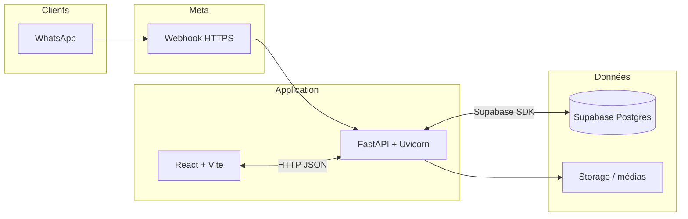

# WhatsApp Inbox

[](.github/workflows/test.yml)

**Boîte de réception équipe pour WhatsApp Business** - messages en temps réel, réponses depuis le web, historique centralisé et assistance IA optionnelle.

[React](https://react.dev/)
[Vite](https://vitejs.dev/)
[FastAPI](https://fastapi.tiangolo.com/)
[Supabase](https://supabase.com/)
[WhatsApp](https://developers.facebook.com/docs/whatsapp)

Canal client · Webhook Meta · Postgres · Auth JWT · Option Gemini

---

## Vue d’ensemble

Les conversations WhatsApp ne restent plus sur un seul téléphone : elles sont **ingérées par l’API Cloud officielle (Meta)**, persistées dans **Supabase (PostgreSQL)** et présentées dans une **SPA React (Vite)**. L’équipe partage la même boîte, avec rôles, médias et option d’IA pour accélérer les réponses tout en gardant le contrôle humain.

|                |                                                                             |
| -------------- | --------------------------------------------------------------------------- |
| **Canal**      | WhatsApp Cloud API - webhook entrant, envoi de messages & templates         |
| **Temps réel** | Mises à jour côté client dès réception / statuts de lecture                 |
| **Données**    | Schéma versionné (`supabase/migrations`), auth Supabase pour l’accès à l’UI |

---

## Architecture (aperçu)



Le **backend** orchestre la signature des webhooks, la logique métier et les appels sortants vers Meta ; le **frontend** consomme l’API après authentification Supabase. Les pièces jointes et profils peuvent transiter par **Storage** selon la configuration.

---

## Trois idées clés

### 1 · WhatsApp reste le canal, le web devient le cockpit

Les clients écrivent sur WhatsApp. Le backend reçoit les événements via **webhook**, enregistre messages et statuts ; l’interface affiche les fils comme une messagerie interne (pièces jointes, indicateurs de lecture).

### 2 · Supabase porte données et accès

Conversations, contacts et médias vivent dans **PostgreSQL**. L’**authentification** des opérateurs passe par Supabase : seuls les comptes autorisés accèdent à la boîte (JWT côté client, politiques côté base selon votre déploiement).

### 3 · Assistant optionnel (Gemini)

Un **mode bot** par conversation peut suggérer des réponses alignées sur votre ton / FAQ ; un humain reprend la main à tout moment.

---

## Fonctionnalités

|                      |                                                                                                |
| -------------------- | ---------------------------------------------------------------------------------------------- |
| **Boîte temps réel** | Réception / envoi, lecture, pièces jointes                                                     |
| **Multi-comptes**    | Plusieurs numéros / WABA dans la même app                                                      |
| **Équipe**           | Rôles et permissions (visibilité, envoi)                                                       |
| **API étendue**      | Médias, templates, profil business, webhooks - exposés côté backend pour aller au-delà de l’UI |
| **Observabilité**    | Instrumentation **Prometheus** (FastAPI), stack **Docker** avec **Grafana** en option          |

---

## Stack technique

| Couche             | Technologies                                                                 |
| ------------------ | ---------------------------------------------------------------------------- |
| **UI**             | React 18, Vite, React Router, Axios, `@supabase/supabase-js`                 |
| **API**            | Python, **FastAPI**, **Uvicorn**, **httpx**, **asyncpg**, **Pydantic v2**    |
| **Données & auth** | Supabase (Postgres, Auth, Storage), migrations SQL                           |
| **Canal**          | WhatsApp Cloud API (Meta)                                                    |
| **IA (optionnel)** | Google Gemini                                                                |
| **Qualité / perf** | **Ruff**, ESLint, Prettier, Vitest, **Locust** (charge), **slowapi** (rate limit) |

---

## Ports et URLs (référence rapide)

| Service / entrée        | URL ou port par défaut | Notes                                      |
| ----------------------- | ---------------------- | ------------------------------------------ |
| **API FastAPI**         | `http://localhost:8000` | OpenAPI / Swagger : `/docs`               |
| **Frontend Vite (dev)** | `http://localhost:5173` | `npm run dev` dans `frontend/`             |
| **Frontend (Docker)**   | `http://localhost:3000` | `docker-compose.yml` (image nginx)         |
| **Prometheus**          | `http://localhost:9090` | Avec `docker-compose.yml`                  |
| **Grafana**             | `http://localhost:3001` | Avec `docker-compose.yml`                  |

Après publication sur GitHub, vous pouvez remplacer le badge CI ci-dessus par l’image standard du workflow :  
`https://github.com/<org>/<repo>/actions/workflows/test.yml/badge.svg` (voir `Actions` sur le dépôt).

---

## Démarrage local

1. **Éditeur** : [Visual Studio Code](https://code.visualstudio.com/) ou [Cursor](https://cursor.com/) - conteneur de dev : dossier [.devcontainer/](.devcontainer/).
2. **Onboarding pas à pas** : joindre [notebooks/EQUIPE_ONBOARDING_FROM_ZERO.ipynb](./notebooks/EQUIPE_ONBOARDING_FROM_ZERO.ipynb) au mail et indiquer dans le **même message** l’**URL du dépôt** GitHub (HTTPS ou SSH). Une phrase suffit côté lead : *« Installe [VS Code](https://code.visualstudio.com/download), ouvre la pièce jointe, suis le notebook. »* Le notebook est **autonome** (liens, message type pour demander les accès, commandes).
3. **Comptes** : projet [Supabase](https://supabase.com/), app [Meta for Developers](https://developers.facebook.com/) avec WhatsApp activé, variables copiées depuis [backend/.env.example](./backend/.env.example) et selon le cas [frontend/.env.example](./frontend/.env.example).

**Contrôles locaux alignés sur la CI** : `make check` ou `npm run ci:check` à la racine (voir [CONTRIBUTING.md](./CONTRIBUTING.md)). Utilisez un interpréteur **Python 3.11** ; si besoin, définissez `PYTHON` vers son exécutable avant de lancer la commande.

---

## Documentation

| Sujet                                                       | Lien                                                                                                                                                    |
| ----------------------------------------------------------- | ------------------------------------------------------------------------------------------------------------------------------------------------------- |
| **Hub équipe** (onboarding, dépannage, sécurité, glossaire) | [docs/equipe/README.md](./docs/equipe/README.md)                                                                                                        |
| Contribuer (branches, tests, lint, structure)               | [CONTRIBUTING.md](./CONTRIBUTING.md)                                                                                                                    |
| Licence                                                     | [LICENSE](./LICENSE)                                                                                                                                   |
| Signalement sécurité                                        | [SECURITY.md](./SECURITY.md)                                                                                                                            |
| Installation complète                                       | [notebooks/EQUIPE_ONBOARDING_FROM_ZERO.ipynb](./notebooks/EQUIPE_ONBOARDING_FROM_ZERO.ipynb)                                                            |
| Schéma & migrations                                         | [supabase/migrations](./supabase/migrations) · [supabase/schema/README.md](./supabase/schema/README.md) · [Schéma LMDCVTC (inbox)](./docs/equipe/schema-lmdcvtc-inbox.md) |
| API interactive                                             | `http://localhost:8000/docs` une fois le backend démarré                                                                                                 |
| Décisions d’architecture (ADRs)                             | [docs/equipe/adr/](./docs/equipe/adr/)                                                                                                                  |

---

## Arborescence du dépôt

```
whatsapp-inbox/
├── backend/           # FastAPI, intégration WhatsApp, webhooks
├── frontend/          # SPA React (Vite)
├── supabase/          # Migrations, Edge Functions, archive des anciens schema/*.sql
├── deploy/            # Scripts & fichiers de production
├── docs/equipe/       # Onboarding équipe, troubleshooting, ADRs
├── notebooks/         # Guides d’onboarding équipe (pas à pas technique)
├── scripts/           # Automatisation locale (ex. ci-check.mjs)
├── .devcontainer/     # Environnement de dev conteneurisé (Python 3.11 + Node 20)
├── Makefile           # cible make check ≈ jobs backend + frontend de la CI
└── docker-compose.yml # Stack locale (backend, frontend, monitoring)
```

---

## Docker (optionnel)

Le `docker-compose.yml` à la racine peut monter backend, frontend et outillage **Prometheus / Grafana** pour le dev ou la démo. Les variables sont lues depuis les `.env` du backend et du frontend.

---

## Contribution & secrets

Voir [CONTRIBUTING.md](./CONTRIBUTING.md) (PR, tests, emplacement du code) et le hub [docs/equipe/](./docs/equipe/README.md) (premiers jours, dépannage, sécurité). Les PR ouvertes sur GitHub utilisent le modèle décrit dans [.github/pull_request_template.md](./.github/pull_request_template.md).

Évolutions sur la branche principale du dépôt. **Ne jamais committer** les clés Meta, Supabase ou Gemini : uniquement `.env` locaux ou secrets CI.

En cas de blocage : [docs/equipe/troubleshooting.md](./docs/equipe/troubleshooting.md), le notebook d’onboarding, puis les liens ci-dessus ; joindre les **messages d’erreur complets** pour accélérer le diagnostic.

---

**WhatsApp Inbox** - une boîte partagée, branchée sur l’API officielle.
