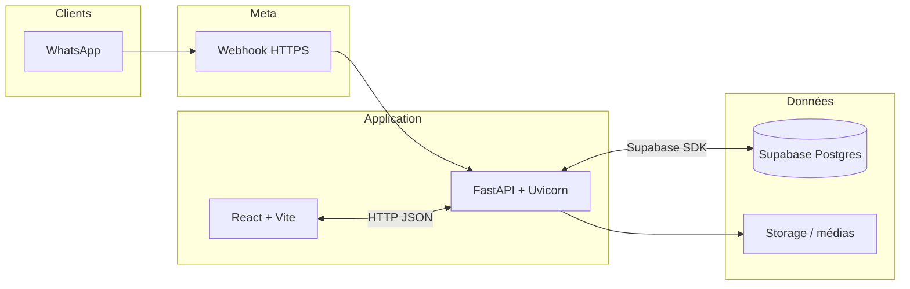

<div align="center">

# WhatsApp Inbox

**Boîte de réception équipe pour WhatsApp Business** - messages en temps réel, réponses depuis le web, historique centralisé et assistance IA optionnelle.

<br/>

[](https://react.dev/)
[](https://vitejs.dev/)
[](https://fastapi.tiangolo.com/)
[](https://supabase.com/)
[](https://developers.facebook.com/docs/whatsapp)

<br/>

<sub>Canal client · Webhook Meta · Postgres · Auth JWT · Option Gemini</sub>

</div>

<br/>

---

## Vue d’ensemble

Les conversations WhatsApp ne restent plus sur un seul téléphone : elles sont **ingérées par l’API Cloud officielle (Meta)**, persistées dans **Supabase (PostgreSQL)** et présentées dans une **SPA React (Vite)**. L’équipe partage la même boîte, avec rôles, médias et option d’IA pour accélérer les réponses tout en gardant le contrôle humain.

| | |
|:---:|:---|
| **Canal** | WhatsApp Cloud API - webhook entrant, envoi de messages & templates |
| **Temps réel** | Mises à jour côté client dès réception / statuts de lecture |
| **Données** | Schéma versionné (`supabase/migrations`), auth Supabase pour l’accès à l’UI |

---

## Architecture (aperçu)



Le **backend** orchestre la signature des webhooks, la logique métier et les appels sortants vers Meta ; le **frontend** consomme l’API après authentification Supabase. Les pièces jointes et profils peuvent transiter par **Storage** selon la configuration.

---

## Trois idées clés

### 1 · WhatsApp reste le canal, le web devient le cockpit

Les clients écrivent sur WhatsApp. Le backend reçoit les événements via **webhook**, enregistre messages et statuts ; l’interface affiche les fils comme une messagerie interne (pièces jointes, indicateurs de lecture).

### 2 · Supabase porte données et accès

Conversations, contacts et médias vivent dans **PostgreSQL**. L’**authentification** des opérateurs passe par Supabase : seuls les comptes autorisés accèdent à la boîte (JWT côté client, politiques côté base selon votre déploiement).

### 3 · Assistant optionnel (Gemini)

Un **mode bot** par conversation peut suggérer des réponses alignées sur votre ton / FAQ ; un humain reprend la main à tout moment.

---

## Fonctionnalités

| | |
|:---|:---|
| **Boîte temps réel** | Réception / envoi, lecture, pièces jointes |
| **Multi-comptes** | Plusieurs numéros / WABA dans la même app |
| **Équipe** | Rôles et permissions (visibilité, envoi) |
| **API étendue** | Médias, templates, profil business, webhooks - exposés côté backend pour aller au-delà de l’UI |
| **Observabilité** | Instrumentation **Prometheus** (FastAPI), stack **Docker** avec **Grafana** en option |


---

## Stack technique

| Couche | Technologies |
|:--|:--|
| **UI** | React 18, Vite, React Router, Axios, `@supabase/supabase-js` |
| **API** | Python, **FastAPI**, **Uvicorn**, **httpx**, **asyncpg**, **Pydantic v2** |
| **Données & auth** | Supabase (Postgres, Auth, Storage), migrations SQL |
| **Canal** | WhatsApp Cloud API (Meta) |
| **IA (optionnel)** | Google Gemini |
| **Qualité / perf** | ESLint, Prettier, Vitest, **Locust** (charge), **slowapi** (rate limit) |

---

## Démarrage local

1. **Éditeur** : [Visual Studio Code](https://code.visualstudio.com/) ou [Cursor](https://cursor.com/).
2. **Onboarding pas à pas** (Git, Python, Node, Docker, clés API…) : ouvrir le notebook  
   **[`notebooks/EQUIPE_ONBOARDING_FROM_ZERO.ipynb`](./notebooks/EQUIPE_ONBOARDING_FROM_ZERO.ipynb)** et suivre les cellules dans l’ordre.
3. **Comptes** : projet [Supabase](https://supabase.com/), app [Meta for Developers](https://developers.facebook.com/) avec WhatsApp activé, variables copiées depuis **`backend/.env.example`** (et équivalent frontend selon votre setup).

---

## Documentation

| Sujet | Lien |
|:--|:--|
| Installation complète | [notebooks/EQUIPE_ONBOARDING_FROM_ZERO.ipynb](./notebooks/EQUIPE_ONBOARDING_FROM_ZERO.ipynb) |
| Schéma & migrations | [`supabase/schema`](./supabase/schema) · [`supabase/migrations`](./supabase/migrations) |
| API interactive | `http://localhost:8000/docs` une fois le backend démarré |

---

## Arborescence du dépôt

```
whatsapp-inbox/
├── backend/           # FastAPI, intégration WhatsApp, webhooks
├── frontend/          # SPA React (Vite)
├── supabase/          # Schémas, migrations, Edge Functions
├── deploy/            # Scripts & fichiers de production
├── notebooks/         # Guides d’onboarding équipe
└── docker-compose.yml # Stack locale (backend, frontend, monitoring)
```

---

## Docker (optionnel)

Le `docker-compose.yml` à la racine peut monter backend, frontend et outillage **Prometheus / Grafana** pour le dev ou la démo. Les variables sont lues depuis les `.env` du backend et du frontend.

---

## Contribution & secrets

Évolutions sur la branche principale du dépôt. **Ne jamais committer** les clés Meta, Supabase ou Gemini : uniquement `.env` locaux ou secrets CI.

En cas de blocage : notebook d’onboarding puis les liens ci-dessus ; joindre les **messages d’erreur complets** pour accélérer le diagnostic.

---

<div align="center">


**WhatsApp Inbox** - une boîte partagée, branchée sur l’API officielle.


</div>
